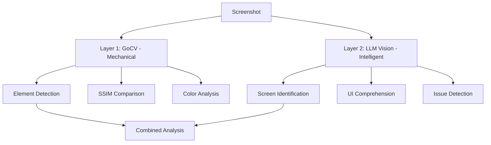
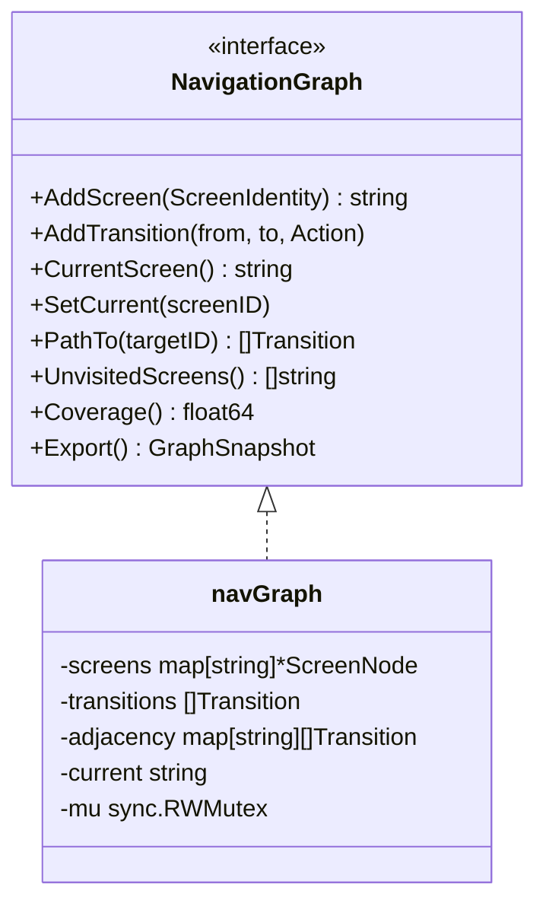

# VisionEngine Architecture

## Module Structure

```
VisionEngine/
├── pkg/
│   ├── analyzer/    # Core interfaces and types
│   ├── graph/       # NavigationGraph (imported by HelixQA)
│   ├── llmvision/   # LLM Vision API adapters (Gemini, Anthropic, OpenAI, Qwen, Ollama)
│   ├── remote/      # Remote Ollama deployment via SSH (auto-install, model pull, lifecycle)
│   ├── opencv/      # OpenCV stubs (real impl behind build tag)
│   └── config/      # Configuration
├── go.mod
├── Makefile
└── Upstreams/       # Remote sync scripts
```

## Two-Layer Analysis Pipeline



## NavigationGraph



## Thread Safety

- NavigationGraph uses `sync.RWMutex` for all operations
- FallbackProvider uses `sync.RWMutex` for provider list access
- All concurrent operations are race-detector safe

## Build Tags

- Default build: No OpenCV, stubs return errors, LLM providers work
- `vision` tag: Full OpenCV support via GoCV
