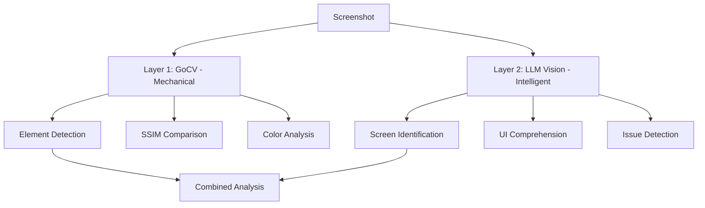
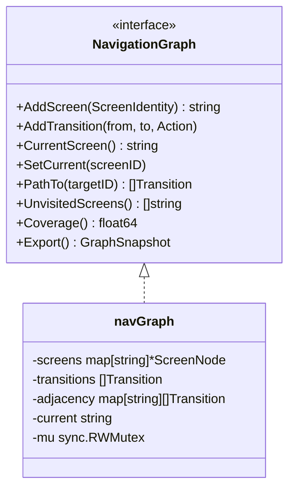

# VisionEngine Architecture

## Module Structure

```
VisionEngine/
├── pkg/
│   ├── analyzer/    # Core interfaces and types
│   ├── graph/       # NavigationGraph (imported by HelixQA)
│   ├── llmvision/   # LLM Vision API adapters (Gemini, Anthropic, OpenAI, Qwen, Ollama)
│   ├── remote/      # Remote Ollama deployment via SSH (auto-install, model pull, lifecycle)
│   ├── opencv/      # OpenCV stubs (real impl behind build tag)
│   └── config/      # Configuration
├── go.mod
├── Makefile
└── Upstreams/       # Remote sync scripts
```

## Vision Providers

VisionEngine supports 7 cloud/local vision providers plus a fallback chain:

| Provider | File | API | Notes |
|----------|------|-----|-------|
| OpenAI | `openai.go` | GPT-4o vision | Cloud, rate-limited |
| Anthropic | `anthropic.go` | Claude vision | Cloud, rate-limited |
| Gemini | `gemini.go` | Gemini 2.0 Flash | Cloud, primary for HelixQA autonomous |
| Qwen | `qwen.go` | Qwen VL Max | Cloud |
| Kimi | `kimi.go` | Kimi/Moonshot | Cloud |
| StepFun | `stepgui.go` | Step-1.5v | Cloud |
| Ollama | `ollama.go` | Any local model | Local, free, no rate limits |
| Fallback | `fallback.go` | Multi-provider chain | Tries providers in order until one succeeds |

Provider selection is configured via `HELIX_VISION_PROVIDER`:
- `auto` — Probes all configured providers, uses FallbackProvider
- `openai`, `anthropic`, `gemini`, etc. — Use a specific provider
- `ollama` — Use local Ollama instance

### Local Model Support (Ollama)

The Ollama provider (`pkg/llmvision/ollama.go`) connects to any Ollama instance:
- Configured via `HELIX_OLLAMA_URL` (e.g., `http://thinker.local:11434`)
- Supports any vision model (e.g., `minicpm-v:8b`, `llava:7b`)
- Zero cost, no rate limits, full privacy
- Auto-deployment via `pkg/remote/` ensures Ollama + model are running on remote hosts

### Distributed Vision (llama.cpp RPC)

The `pkg/remote/` package manages distributed inference:
- `hardware.go` — Detects GPU (NVIDIA), CPU, and RAM on remote hosts via SSH
- `llamacpp.go` — Manages llama.cpp RPC workers across multiple hosts
- Each worker contributes its VRAM/RAM to the inference pool
- Configured via `HELIX_LLAMACPP_RPC_WORKERS` and `HELIX_LLAMACPP_RPC_MODEL`

## Two-Layer Analysis Pipeline



## NavigationGraph



## Thread Safety

- NavigationGraph uses `sync.RWMutex` for all operations
- FallbackProvider uses `sync.RWMutex` for provider list access
- All concurrent operations are race-detector safe

## Build Tags

- Default build: No OpenCV, stubs return errors, LLM providers work
- `vision` tag: Full OpenCV support via GoCV
